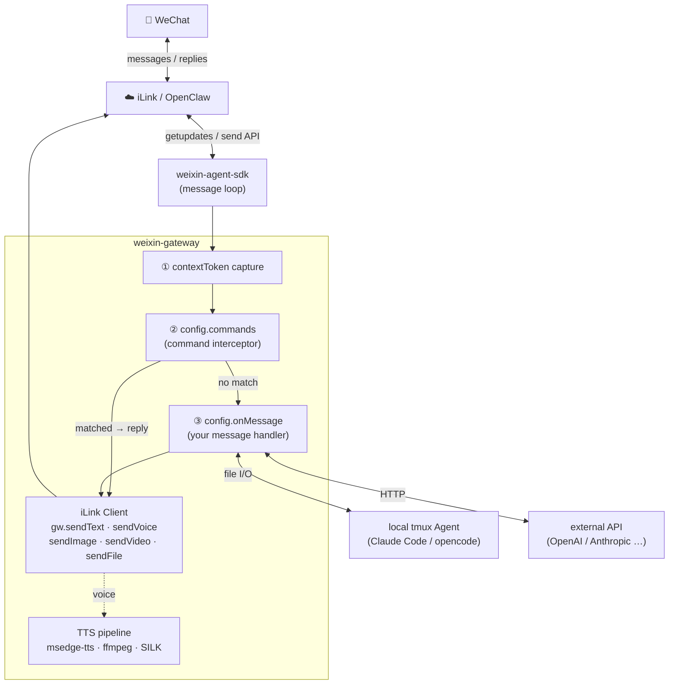

# weixin-gateway

WeChat personal assistant gateway — QR login, contextToken capture, TTS voice, and proactive media sending via [weixin-agent-sdk](https://www.npmjs.com/package/weixin-agent-sdk).

Bring your own message handler — connect to any local agent via tmux, call an API directly, or mix both. No hardcoded AI backend.

## Architecture



## Installation

```
npm install weixin-gateway
```

## Quick Start

```js
const { createWeixinGateway, MemoryAdapter } = require('weixin-gateway');

const gw = createWeixinGateway({
  storage: new MemoryAdapter(),
  onMessage: async ({ wxId, text, media }) => {
    // called for every incoming WeChat message
    const reply = await myAI(text);
    return { text: reply };   // return { text } → auto-sent as reply
    // return null            → skip auto-reply; call gw.sendText/sendVoice yourself
  },
});

// Subscribe to login events
gw.subscribe(event => {
  if (event.type === 'qr')     console.log('Scan QR:', event.qrUrl);
  if (event.type === 'status') console.log('State:', event.state);
});

await gw.start();   // shows QR code, blocks until WeChat is connected
```

### Proactive sends

After a user sends you at least one message, their `contextToken` is captured and you can push messages at any time:

```js
await gw.sendText(wxId, 'Hello!');
await gw.sendVoice(wxId, '你好，这是语音消息');           // TTS → SILK
await gw.sendImage(wxId, 'https://example.com/img.jpg'); // URL or local path
await gw.sendVideo(wxId, url);                           // Bilibili URLs auto-downloaded
await gw.sendFile(wxId, '/path/to/report.pdf');
```

### Restore from saved credentials

Skip QR scan if you already have valid credentials:

```js
const gw = createWeixinGateway({ storage: new MemoryAdapter() });

// accountId and sessions come from a previous gw.getStatus() call
gw.restore(accountId, [{ wxId, contextToken, nickname }]);

await gw.sendText(wxId, 'Hello');
```

## HTTP Server (Express)

```js
const express = require('express');
const { createWeixinRouter, MemoryAdapter } = require('weixin-gateway');

const app = express();
app.use(express.json());

const { router, autoStartIfLoggedIn } = createWeixinRouter({
  storage: new MemoryAdapter(),
  onMessage: async ({ wxId, text }) => {
    return { text: `echo: ${text}` };
  },
});

app.use('/weixin', router);
app.listen(3000, () => {
  autoStartIfLoggedIn().catch(console.error);   // auto-reconnect if token exists
});
```

## Config

| Option | Type | Default | Description |
|---|---|---|---|
| `storage` | `StorageAdapter` | `MemoryAdapter` | Storage adapter for message/session persistence. |
| `onMessage` | `async (params) => {text}|null` | `null` | Incoming message handler. Params: `{ wxId, text, media, contextToken, sendMessage }`. Return `{ text }` to auto-reply, `null` to handle manually. |
| `voice` | `string` | `zh-CN-XiaoxiaoNeural` | Default TTS voice. Any [Edge TTS ShortName](https://learn.microsoft.com/en-us/azure/ai-services/speech-service/language-support). |
| `commands` | `Command[]` | `[]` | Pre-message-handler command interceptors (see below). |
| `ffmpegPath` | `string` | auto-detected | Override ffmpeg binary path. |
| `ytdlpPath` | `string` | auto-detected | Override yt-dlp binary path. |

### `config.commands`

Commands run before `onMessage`. If a command matches, `onMessage` is skipped and the command reply is sent directly.

```js
const gw = createWeixinGateway({
  commands: [
    {
      match(text, wxId) {
        if (text === '/ping') return 'pong';
        return null;   // not matched → fall through to onMessage
      },
      usage: '/ping',
      desc: '连通性测试',
    },
  ],
});
```

- `match(text, wxId)` — return a string to reply, `null`/`undefined` to pass through
- `usage` + `desc` — optional; triggers auto-generated `/help` / `帮助` reply when defined

## TTS Voices

The bundled `lib/voice.js` exports voice lookup helpers — useful for building a voice-switching command:

```js
const { VOICE_ALIASES, VOICE_NOTES, resolveVoice } = require('weixin-gateway/lib/voice');

// List all available voices
Object.entries(VOICE_NOTES).forEach(([alias, note]) => {
  console.log(`${alias}（${VOICE_ALIASES[alias]}）— ${note}`);
});

// Resolve alias / pinyin / ShortName to canonical ShortName
resolveVoice('晓晓')              // → 'zh-CN-XiaoxiaoNeural'
resolveVoice('yunxi')             // → 'zh-CN-YunxiNeural'
resolveVoice('zh-CN-YunxiNeural') // → 'zh-CN-YunxiNeural'
resolveVoice('unknown')           // → null

// Example: voice-switching command
commands: [{
  match(text, wxId) {
    const m = text.match(/^\/voice (.+)/);
    if (!m) return null;
    const shortName = resolveVoice(m[1]);
    if (!shortName) return `未知音色：${m[1]}`;
    myVoiceMap.set(wxId, shortName);
    return `已切换至 ${m[1]}`;
  },
  usage: '/voice <音色>',
  desc: '切换 TTS 音色',
}]
```

Built-in aliases cover: Mandarin (晓晓/晓伊/云希/云扬…), regional dialects (东北/陕西/台湾/粤语), and English voices (ava/emma/andrew/brian/jenny…). Pass any raw `ShortName` (containing "Neural") and it passes through unchanged.

## SDK Reference

### Lifecycle

| Method | Description |
|---|---|
| `gw.start()` | Start daemon, show QR code, wait for scan. |
| `gw.stop()` | Stop daemon, disconnect WeChat. |
| `gw.startIfLoggedIn()` | Auto-reconnect using saved token. No-op if not logged in. |
| `gw.restore(accountId, sessions)` | Inject existing credentials — no QR required. `sessions`: `[{ wxId, contextToken, nickname? }]` |

### Status

| Method | Description |
|---|---|
| `gw.getStatus()` | Returns `{ state, accountId, sessions }`. `state`: `'idle'|'qr_pending'|'connected'` |
| `gw.getSessions()` | Returns `sessions` array. Each entry: `{ wxId, nickname, lastActive, contextToken }` |

### Send

All send methods throw if `contextToken` is not yet available for that user.

| Method | Description |
|---|---|
| `gw.sendText(wxId, text)` | Send a text message. |
| `gw.sendVoice(wxId, text)` | Convert text to SILK voice via TTS and send. |
| `gw.sendImage(wxId, urlOrPath)` | Send an image (HTTP URL or local file). |
| `gw.sendVideo(wxId, url)` | Send a video. Bilibili URLs auto-downloaded via yt-dlp. |
| `gw.sendFile(wxId, filePath)` | Send a local file. |

### Events

```js
const unsubscribe = gw.subscribe(event => {
  // event.type === 'qr'     → { qrUrl: string }
  // event.type === 'status' → { state: string }
});
unsubscribe(); // stop listening
```

### Session

| Method | Description |
|---|---|
| `gw.deleteSession(wxId)` | Remove a user's session from memory (storage record kept). |

## HTTP Routes

Exposed by `createWeixinRouter`. Mount at any prefix (e.g. `app.use('/weixin', router)`).

| Method | Path | Description |
|---|---|---|
| `GET` | `/status` | Daemon state and active sessions |
| `GET` | `/qr-sse` | SSE stream — `{ qrUrl }` on QR update, `{ type: 'weixin_status', state }` on state change |
| `POST` | `/start` | Start daemon |
| `POST` | `/stop` | Stop daemon |
| `POST` | `/tts` | `{ wxId?, text }` — send TTS voice |
| `DELETE` | `/session/:wxId` | Remove a user session from memory |
| `GET` | `/media/:id` | Serve a stored media blob |
| `GET` | `/localfile?path=` | Serve a local `/tmp/` file (frontend preview) |
| `GET` | `/rounds` | Conversation rounds `?wxId=&limit=30&offset=0` |
| `GET` | `/messages` | Raw message log `?wxId=&limit=50&offset=0` |

## Bundled Instruction Template

A production-ready Claude Code instruction template is bundled at `config/instruction.md`. It covers scene detection (tech / research / translation / writing / chat), pure-text output rules, media markers (`[图片:]`, `[视频:]`, `[B站视频:]`, `[截图:]`), and browser screenshot/recording conventions.

Useful when building a file-based backend where the AI reads a prompt file and writes its reply to a response file:

```js
const path = require('path');
const fs   = require('fs');

// Load the bundled template
const tplPath = path.join(path.dirname(require.resolve('weixin-gateway')), 'config', 'instruction.md');
const template = fs.readFileSync(tplPath, 'utf8');

// Use it in your onMessage handler
onMessage: async ({ wxId, text }) => {
  const responseFile = `/tmp/resp-${Date.now()}.txt`;
  const instruction  = template
    .replace('{{message}}',      text)
    .replace('{{responseFile}}', responseFile);

  // Write instruction to a file, let your AI agent read and respond
  fs.writeFileSync(`/tmp/input-${Date.now()}.txt`, instruction);
  // ... wait for responseFile to appear, read and return it
}
```

## Storage Adapter

Implement this interface for persistent storage (SQLite, PostgreSQL, etc.):

```js
class MyAdapter {
  // Messages
  saveMessage(wxId, direction, content, pairId, ts) {}
  getMessages(wxId, limit, offset)      // → { messages, total }
  getRounds(wxId, limit, offset)        // → { rounds, total }
  getUnpairedMessages()                 // → [{ id, wx_id, direction }]
  updateMessagePairIds(updates)         // updates: [{ id, pairId }]
  getMaxPairIds()                       // → [{ wx_id, max_pair }]
  deleteOldMessages(cutoffTs)           // → { changes }

  // Media blobs
  saveMedia(wxId, pairId, direction, mediaType, mime, data, ts)  // → id
  getMedia(id)                          // → { mime, data } | null

  // Sessions
  upsertSession(wxId, nickname, presetType, presetCommand, presetDir, ttsVoice, lastActive, contextToken) {}
  getSessions()                         // → rows[]
}
```

The built-in `MemoryAdapter` (no persistence) is used by default.

## Requirements

- **Node >= 18**
- **ffmpeg** — TTS pipeline (MP3 → PCM → SILK)
- **yt-dlp** — Bilibili video downloads (optional)
- Any WeChat account — connect by scanning the QR code

## License

MIT
