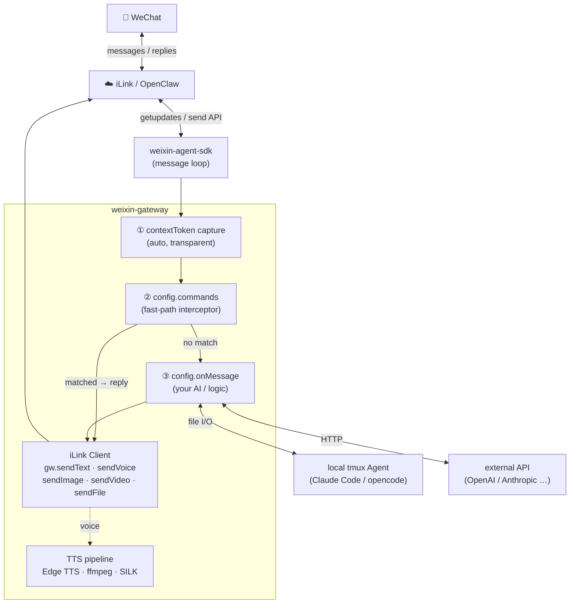

# weixin-gateway

**[中文](./README.zh.md) | English**

Connect any AI backend to WeChat Personal in minutes — QR login, automatic contextToken capture, proactive multi-media push, and a built-in TTS → SILK voice pipeline.

> **Bring your own AI.** `onMessage` is a plain async callback. Wire it to Claude, GPT, a local agent, or anything else — no hardcoded backend, no vendor lock-in.

## Why weixin-gateway?

| Pain point | How it's solved |
|---|---|
| contextToken is hard to get | Captured automatically via fetch interceptor on every getupdates response |
| Proactive push is blocked without prior context | First inbound message persists the token; push any media at any time after that |
| WeChat voice requires proprietary SILK format | Built-in pipeline: Edge TTS → ffmpeg PCM → silk-sdk SILK |
| Video delivery is fragmented | `sendVideo(wxId, urlOrPath)` handles direct URL, local file, and Bilibili in one call |
| Tying message routing to a specific AI | `onMessage` callback owns all logic; `config.commands` handles fast-path replies before the AI sees them |

## Architecture



## Installation

```
npm install weixin-gateway
```

Requires **Node ≥ 18** and **ffmpeg** (for TTS voice). yt-dlp is optional (Bilibili only).

## Quick Start

```js
const { createWeixinGateway, MemoryAdapter } = require('weixin-gateway');

const gw = createWeixinGateway({
  storage: new MemoryAdapter(),
  onMessage: async ({ wxId, text, media }) => {
    const reply = await myAI(text);
    return { text: reply };   // → auto-reply
    // return null            → skip auto-reply; call gw.send* yourself
  },
});

gw.subscribe(event => {
  if (event.type === 'qr')     console.log('Scan QR:', event.qrUrl);
  if (event.type === 'status') console.log('State:', event.state);
});

await gw.start();   // displays QR, blocks until connected
```

## Media Sending

Once a user sends their first message, their `contextToken` is captured and you can push any media at any time — no polling, no extra setup.

```js
await gw.sendText(wxId, 'Hello!');
await gw.sendVoice(wxId, 'Text converted to WeChat voice bubble via TTS');  // TTS → SILK
await gw.sendImage(wxId, 'https://example.com/img.jpg');  // URL or local path
await gw.sendImage(wxId, '/tmp/screenshot.png');
await gw.sendVideo(wxId, 'https://example.com/clip.mp4'); // direct URL
await gw.sendVideo(wxId, '/tmp/local.mp4');               // local file
await gw.sendVideo(wxId, 'https://www.bilibili.com/video/BVxxx'); // Bilibili → yt-dlp
await gw.sendFile(wxId,  '/path/to/report.pdf');
```

### TTS Voice Pipeline

`sendVoice` converts text to a native WeChat voice bubble — no audio files to manage:

```
text → Edge TTS (MP3) → ffmpeg (PCM s16le 16kHz) → silk-sdk (SILK) → WeChat CDN → voice_item
```

Switch voices per user or globally via `config.voice` or `lib/voice.js`:

```js
const { resolveVoice } = require('weixin-gateway/lib/voice');

resolveVoice('晓晓')              // → 'zh-CN-XiaoxiaoNeural'
resolveVoice('yunxi')             // → 'zh-CN-YunxiNeural'
resolveVoice('zh-CN-YunxiNeural') // passes through unchanged
resolveVoice('unknown')           // → null

// Voice-switching command
commands: [{
  match(text, wxId) {
    const m = text.match(/^\/voice (.+)/);
    if (!m) return null;
    const shortName = resolveVoice(m[1]);
    if (!shortName) return `Unknown voice: ${m[1]}`;
    myVoiceMap.set(wxId, shortName);
    return `Switched to ${m[1]}`;
  },
  usage: '/voice <name>',
  desc: 'Switch TTS voice',
}]
```

Built-in aliases: Mandarin (晓晓/晓伊/云希/云扬…), regional dialects (东北/陕西/台湾/粤语), English (ava/emma/andrew/brian/jenny…). Any raw ShortName containing "Neural" passes through.

## Command Interceptors

`config.commands` run before `onMessage` — ideal for fast replies, toggles, and admin commands that bypass the AI:

```js
commands: [
  {
    match(text, wxId) {
      if (text === '/ping') return 'pong';
    },
    usage: '/ping',
    desc: 'Connectivity check',
  },
  {
    match(text, wxId) {
      const m = text.match(/^\/echo (.+)/);
      if (m) return m[1];
    },
    usage: '/echo <text>',
    desc: 'Echo a message',
  },
],
```

- `match(text, wxId)` — return a string to reply; return nothing to fall through to `onMessage`
- Setting `usage` + `desc` on any command enables auto-generated `/help` and `帮助` replies

## HTTP Server (Express)

```js
const express = require('express');
const { createWeixinRouter, MemoryAdapter } = require('weixin-gateway');

const app = express();
app.use(express.json());

const { router, autoStartIfLoggedIn } = createWeixinRouter({
  storage: new MemoryAdapter(),
  onMessage: async ({ wxId, text }) => ({ text: `echo: ${text}` }),
});

app.use('/weixin', router);
app.listen(3000, () => {
  autoStartIfLoggedIn().catch(console.error); // reconnect if token is saved
});
```

### Restore from Saved Credentials

Skip QR scan when credentials are already available:

```js
gw.restore(accountId, [{ wxId, contextToken, nickname }]);
await gw.sendText(wxId, 'Back online');
```

## Config

| Option | Type | Default | Description |
|---|---|---|---|
| `storage` | `StorageAdapter` | `MemoryAdapter` | Storage adapter for messages and sessions. |
| `onMessage` | `async (params) => {text}\|null` | `null` | Message handler. Params: `{ wxId, text, media, contextToken, sendMessage }`. Return `{ text }` to auto-reply, `null` to handle sends yourself. |
| `voice` | `string` | `zh-CN-XiaoxiaoNeural` | Default TTS voice. Any [Edge TTS ShortName](https://learn.microsoft.com/en-us/azure/ai-services/speech-service/language-support). |
| `commands` | `Command[]` | `[]` | Pre-`onMessage` interceptors. |
| `ffmpegPath` | `string` | auto-detected | Override ffmpeg path. |
| `ytdlpPath` | `string` | auto-detected | Override yt-dlp path (Bilibili only). |

## SDK Reference

### Lifecycle

| Method | Description |
|---|---|
| `gw.start()` | Start, show QR, wait for scan. |
| `gw.stop()` | Stop and disconnect. |
| `gw.startIfLoggedIn()` | Reconnect from saved token. No-op if not logged in. |
| `gw.restore(accountId, sessions)` | Inject credentials — skip QR. `sessions`: `[{ wxId, contextToken, nickname? }]` |

### Status

| Method | Description |
|---|---|
| `gw.getStatus()` | `{ state, accountId, sessions }`. state: `'idle'|'qr_pending'|'connected'` |
| `gw.getSessions()` | Sessions array: `[{ wxId, nickname, lastActive, contextToken }]` |

### Send

All send methods throw if `contextToken` is not yet available for the target user.

| Method | Description |
|---|---|
| `gw.sendText(wxId, text)` | Text message. |
| `gw.sendVoice(wxId, text)` | TTS → SILK voice bubble. |
| `gw.sendImage(wxId, urlOrPath)` | Image — HTTP URL or local file path. |
| `gw.sendVideo(wxId, urlOrPath)` | Video — HTTP URL, local file path, or Bilibili link. |
| `gw.sendFile(wxId, filePath)` | Any local file. |

### Events

```js
const off = gw.subscribe(event => {
  // event.type === 'qr'     → { qrUrl: string }
  // event.type === 'status' → { state: string }
});
off(); // unsubscribe
```

### Session

| Method | Description |
|---|---|
| `gw.deleteSession(wxId)` | Remove from memory (storage record kept). |

## HTTP Routes

Exposed by `createWeixinRouter`. Mount at any prefix.

| Method | Path | Description |
|---|---|---|
| `GET` | `/status` | Daemon state and active sessions |
| `GET` | `/qr-sse` | SSE — `{ qrUrl }` on QR update, `{ type: 'weixin_status', state }` on state change |
| `POST` | `/start` | Start daemon |
| `POST` | `/stop` | Stop daemon |
| `POST` | `/tts` | `{ wxId?, text }` — send TTS voice |
| `DELETE` | `/session/:wxId` | Remove session from memory |
| `GET` | `/media/:id` | Serve stored media blob |
| `GET` | `/localfile?path=` | Serve local `/tmp/` file (frontend preview) |
| `GET` | `/rounds` | Conversation rounds `?wxId=&limit=30&offset=0` |
| `GET` | `/messages` | Raw message log `?wxId=&limit=50&offset=0` |

## Bundled Instruction Template

`config/instruction.md` is a production-ready prompt template for Claude Code. It handles scene detection (tech / research / translation / writing / chat), plain-text output rules, and media markers that the gateway resolves automatically:

```
[图片: https://...]     → downloads and sends as image
[视频: https://...]     → downloads and sends as video
[B站视频: https://...]  → yt-dlp download + send
[截图: /tmp/ss.png]    → sends local file
```

Use it in a file-based backend (AI reads prompt file, writes reply to response file):

```js
const tplPath  = require.resolve('weixin-gateway/config/instruction.md');
const template = require('fs').readFileSync(tplPath, 'utf8');

onMessage: async ({ wxId, text }) => {
  const responseFile = `/tmp/resp-${Date.now()}.txt`;
  require('fs').writeFileSync(`/tmp/input-${Date.now()}.txt`,
    template.replace('{{message}}', text).replace('{{responseFile}}', responseFile)
  );
  // ... wait for responseFile, read and return
}
```

## Storage Adapter

Implement this interface for persistent storage (SQLite, PostgreSQL, etc.):

```js
class MyAdapter {
  saveMessage(wxId, direction, content, pairId, ts) {}
  getMessages(wxId, limit, offset)     // → { messages, total }
  getRounds(wxId, limit, offset)       // → { rounds, total }
  getUnpairedMessages()                // → [{ id, wx_id, direction }]
  updateMessagePairIds(updates)        // updates: [{ id, pairId }]
  getMaxPairIds()                      // → [{ wx_id, max_pair }]
  deleteOldMessages(cutoffTs)          // → { changes }

  saveMedia(wxId, pairId, direction, mediaType, mime, data, ts) // → id
  getMedia(id)                         // → { mime, data } | null

  upsertSession(wxId, nickname, presetType, presetCommand, presetDir, ttsVoice, lastActive, contextToken) {}
  getSessions()                        // → rows[]
}
```

## Development

### Project Layout

```
weixin-gateway/
├── index.js            # Public API — createWeixinGateway, createWeixinRouter
├── adapters/
│   └── memory.js       # Built-in MemoryAdapter (no persistence)
├── lib/
│   ├── ilink.js        # iLink/OpenClaw HTTP client — uploadMedia, sendItem
│   ├── media.js        # Media send helpers — image, video, file, Bilibili
│   ├── tts.js          # TTS pipeline — Edge TTS → ffmpeg PCM → silk-sdk SILK
│   └── voice.js        # Voice name resolver (alias → ShortName)
├── config/
│   └── instruction.md  # Bundled Claude Code prompt template
├── examples/
│   ├── server.js       # Full HTTP + AI backend example
│   ├── media-test.js   # Standalone media send test (no server needed)
│   └── quickstart.js   # Minimal onMessage example
└── scripts/
    └── qr-login.js     # Headless QR login helper
```

### Setup

```bash
git clone <repo>
cd weixin-gateway
npm install
```

External dependencies (install separately):

| Tool | Required | Purpose |
|---|---|---|
| `ffmpeg` | Yes | PCM transcoding for TTS voice pipeline |
| `yt-dlp` | No | Bilibili video download (`sendVideo` with bilibili.com links) |

### Running Tests

```bash
npm test
```

Tests use Jest with `supertest`. No WeChat account or network connection required — all iLink calls are mocked.

### Running Examples

**Full server (needs WeChat scan):**

```bash
node examples/server.js
# Scan the QR code in the terminal, then send a WeChat message to trigger onMessage
```

**Media test (requires a saved session from `server.js`):**

```bash
node examples/media-test.js            # all media types
node examples/media-test.js --no-voice # skip TTS (no ffmpeg needed)
node examples/media-test.js --voice-only
```

The test reads credentials from `/tmp/weixin-gateway-session.json` written by `server.js` after a successful QR login.

### Key Internals

**CDN token flow (video / image / file):**

1. `ilink.uploadMedia(wxId, filePath, mediaType)` calls `getuploadurl` to get a pre-signed `upload_param`, encrypts the file with AES-128-ECB, and POSTs ciphertext to the CDN.
2. The CDN responds with `x-encrypted-param` (short token, ~320–700 chars) in the response header.
3. This `shortParam` is returned as `downloadEncryptedQueryParam` and used in the `media` object sent to WeChat — it's what the WeChat client uses to fetch the content.
4. `uploadParam` (the pre-signed upload URL token) is **not** a valid download token for image/video/file — do not use it in `media.encrypt_query_param` for these types.

**Voice is different:** as of 2026-03-27 the CDN stopped issuing `x-encrypted-query-param` for `mediaType=4`. TTS uses `uploadParam` as the download token — this is a confirmed CDN quirk specific to SILK/voice uploads.

### Adding a Storage Adapter

Copy `adapters/memory.js` as a starting point and implement the interface documented in the [Storage Adapter](#storage-adapter) section.

## License

MIT
