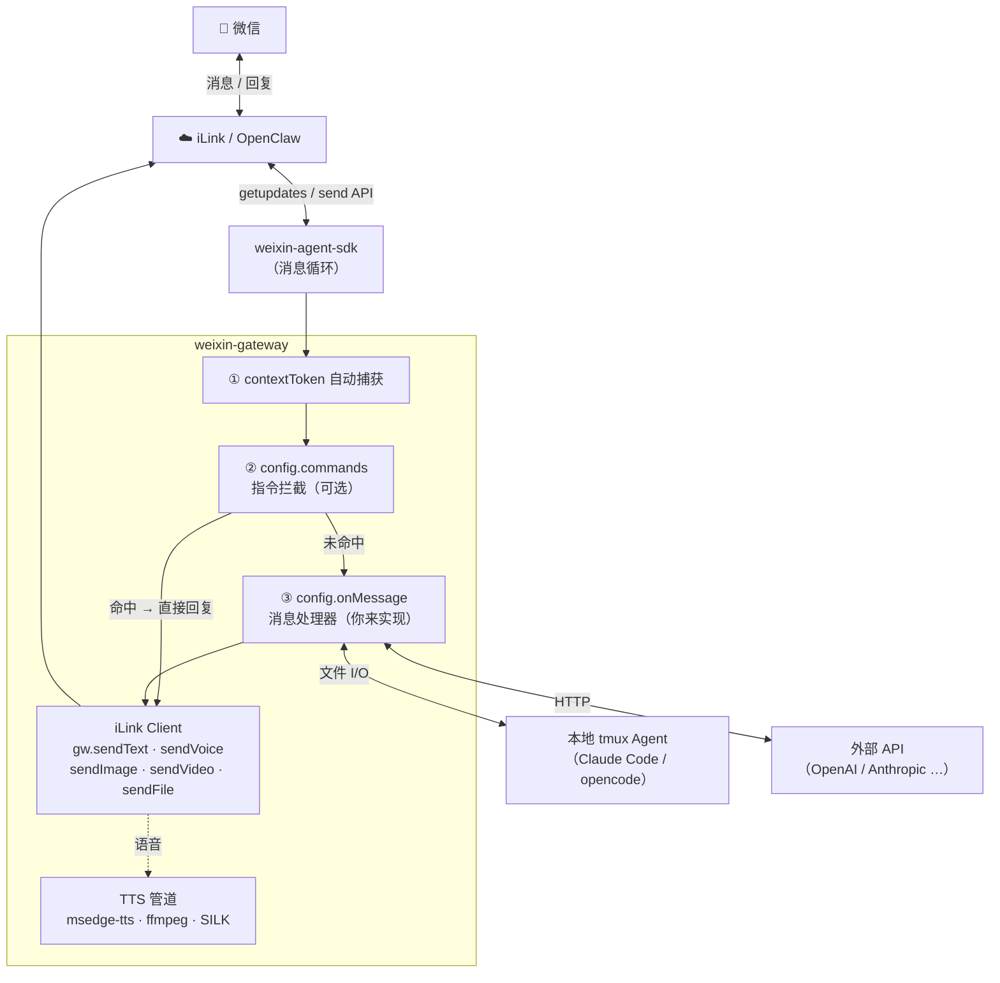

# weixin-gateway

微信个人号助理网关 — 扫码登录、contextToken 自动捕获、TTS 语音、主动媒体发送，基于 [weixin-agent-sdk](https://www.npmjs.com/package/weixin-agent-sdk)。

消息处理器由你定义，可通过本地 tmux 接入任意 Agent，也可直接调用 API——不绑定任何 AI 后端。

## 架构



## 安装

```
npm install weixin-gateway
```

## 快速上手

```js
const { createWeixinGateway, MemoryAdapter } = require('weixin-gateway');

const gw = createWeixinGateway({
  storage: new MemoryAdapter(),
  onMessage: async ({ wxId, text, media }) => {
    // 每条入站微信消息都会调用这里
    const reply = await myAI(text);
    return { text: reply };   // 返回 { text } → 自动回复
    // 返回 null              → 不自动回复，自行调用 gw.sendText / sendVoice 等
  },
});

// 订阅登录事件
gw.subscribe(event => {
  if (event.type === 'qr')     console.log('请扫描二维码：', event.qrUrl);
  if (event.type === 'status') console.log('状态变化：', event.state);
});

await gw.start();   // 显示二维码，阻塞直到微信登录成功
```

### 主动发送消息

用户发过一条消息后，contextToken 自动捕获，之后可随时主动推送：

```js
await gw.sendText(wxId, '你好！');
await gw.sendVoice(wxId, '这是一条语音消息');           // TTS → SILK
await gw.sendImage(wxId, 'https://example.com/img.jpg'); // URL 或本地路径
await gw.sendVideo(wxId, url);                           // B站链接自动下载
await gw.sendFile(wxId, '/path/to/report.pdf');
```

### 使用已有凭证（免扫码）

如果已有有效 session，直接注入，跳过二维码：

```js
const gw = createWeixinGateway({ storage: new MemoryAdapter() });

// accountId 和 sessions 来自之前的 gw.getStatus()
gw.restore(accountId, [{ wxId, contextToken, nickname }]);

await gw.sendText(wxId, '你好');
```

## HTTP 服务（Express）

```js
const express = require('express');
const { createWeixinRouter, MemoryAdapter } = require('weixin-gateway');

const app = express();
app.use(express.json());

const { router, autoStartIfLoggedIn } = createWeixinRouter({
  storage: new MemoryAdapter(),
  onMessage: async ({ wxId, text }) => {
    return { text: `收到：${text}` };
  },
});

app.use('/weixin', router);
app.listen(3000, () => {
  autoStartIfLoggedIn().catch(console.error);   // 有保存的 token 则自动重连
});
```

## 配置项

| 选项 | 类型 | 默认值 | 说明 |
|---|---|---|---|
| `storage` | `StorageAdapter` | `MemoryAdapter` | 存储适配器，用于消息/会话持久化。 |
| `onMessage` | `async (params) => {text}\|null` | `null` | 消息处理回调。参数：`{ wxId, text, media, contextToken, sendMessage }`。返回 `{ text }` 自动回复，返回 `null` 则自行处理。 |
| `voice` | `string` | `zh-CN-XiaoxiaoNeural` | 默认 TTS 音色。支持所有 [Edge TTS ShortName](https://learn.microsoft.com/zh-cn/azure/ai-services/speech-service/language-support)。 |
| `commands` | `Command[]` | `[]` | 消息前置指令拦截器（见下方）。 |
| `ffmpegPath` | `string` | 自动检测 | 手动指定 ffmpeg 路径。 |
| `ytdlpPath` | `string` | 自动检测 | 手动指定 yt-dlp 路径。 |

### `config.commands` — 指令拦截器

指令在 `onMessage` 之前执行。匹配成功则直接回复，不再调用 `onMessage`。

```js
const gw = createWeixinGateway({
  commands: [
    {
      match(text, wxId) {
        if (text === '/ping') return 'pong';
        return null;   // 未匹配 → 继续走 onMessage
      },
      usage: '/ping',
      desc: '连通性测试',
    },
    {
      match(text, wxId) {
        const m = text.match(/^\/echo (.+)/);
        if (m) return m[1];
        return null;
      },
      usage: '/echo <内容>',
      desc: '回显消息',
    },
  ],
});
```

- `match(text, wxId)` — 返回字符串即为回复内容，返回 `null`/`undefined` 表示未匹配
- `usage` + `desc` — 可选；两者都设置时，用户发送 `/help` 或 `帮助` 会自动生成指令列表

## TTS 音色

`lib/voice.js` 导出音色查询工具，方便实现切换音色指令：

```js
const { VOICE_ALIASES, VOICE_NOTES, resolveVoice } = require('weixin-gateway/lib/voice');

// 列出所有可用音色
Object.entries(VOICE_NOTES).forEach(([alias, note]) => {
  console.log(`${alias}（${VOICE_ALIASES[alias]}）— ${note}`);
});

// 将别名 / 拼音 / ShortName 解析为标准 ShortName
resolveVoice('晓晓')              // → 'zh-CN-XiaoxiaoNeural'
resolveVoice('yunxi')             // → 'zh-CN-YunxiNeural'
resolveVoice('zh-CN-YunxiNeural') // → 'zh-CN-YunxiNeural'
resolveVoice('unknown')           // → null

// 示例：切换音色指令
commands: [{
  match(text, wxId) {
    const m = text.match(/^\/voice (.+)/);
    if (!m) return null;
    const shortName = resolveVoice(m[1]);
    if (!shortName) return `未知音色：${m[1]}`;
    myVoiceMap.set(wxId, shortName);
    return `已切换至 ${m[1]}`;
  },
  usage: '/voice <音色>',
  desc: '切换 TTS 音色',
}]
```

内置别名涵盖：普通话（晓晓/晓伊/云希/云扬…）、方言（东北/陕西/台湾/粤语）、英语（ava/emma/andrew/brian/jenny…）。直接传入含 "Neural" 的完整 ShortName 也可透传。

## SDK 接口

### 生命周期

| 方法 | 说明 |
|---|---|
| `gw.start()` | 启动守护进程，显示二维码，等待扫码。 |
| `gw.stop()` | 停止守护进程，断开微信连接。 |
| `gw.startIfLoggedIn()` | 使用已保存的 token 自动重连。未登录时无操作。 |
| `gw.restore(accountId, sessions)` | 注入已有凭证，免扫码。`sessions`：`[{ wxId, contextToken, nickname? }]` |

### 状态查询

| 方法 | 说明 |
|---|---|
| `gw.getStatus()` | 返回 `{ state, accountId, sessions }`。`state`：`'idle'|'qr_pending'|'connected'` |
| `gw.getSessions()` | 返回 `sessions` 数组。每项：`{ wxId, nickname, lastActive, contextToken }` |

### 发送消息

所有发送方法在 contextToken 未就绪时会抛出异常。

| 方法 | 说明 |
|---|---|
| `gw.sendText(wxId, text)` | 发送文字消息。 |
| `gw.sendVoice(wxId, text)` | 文字转语音（TTS → SILK）后发送。 |
| `gw.sendImage(wxId, urlOrPath)` | 发送图片，支持 HTTP URL 或本地文件路径。 |
| `gw.sendVideo(wxId, url)` | 发送视频。B站链接自动调用 yt-dlp 下载。 |
| `gw.sendFile(wxId, filePath)` | 发送本地文件。 |

### 事件订阅

```js
const unsubscribe = gw.subscribe(event => {
  // event.type === 'qr'     → { qrUrl: string }   二维码更新
  // event.type === 'status' → { state: string }    状态变化
});
unsubscribe(); // 取消订阅
```

### 会话管理

| 方法 | 说明 |
|---|---|
| `gw.deleteSession(wxId)` | 从内存中移除该用户的会话（存储记录保留）。 |

## HTTP 路由

由 `createWeixinRouter` 提供，挂载到任意前缀（如 `app.use('/weixin', router)`）。

| 方法 | 路径 | 说明 |
|---|---|---|
| `GET` | `/status` | 守护进程状态及当前会话列表 |
| `GET` | `/qr-sse` | SSE 流 — 二维码更新推送 `{ qrUrl }`，状态变化推送 `{ type: 'weixin_status', state }` |
| `POST` | `/start` | 启动守护进程 |
| `POST` | `/stop` | 停止守护进程 |
| `POST` | `/tts` | `{ wxId?, text }` — 发送 TTS 语音 |
| `DELETE` | `/session/:wxId` | 从内存中移除该用户会话 |
| `GET` | `/media/:id` | 读取已存储的媒体 Blob |
| `GET` | `/localfile?path=` | 提供 `/tmp/` 下的本地文件（前端预览用） |
| `GET` | `/rounds` | 对话轮次 `?wxId=&limit=30&offset=0` |
| `GET` | `/messages` | 原始消息记录 `?wxId=&limit=50&offset=0` |

## 内置指令模板

包内附带一份完整的 Claude Code 微信助理提示词，路径为 `config/instruction.md`。

涵盖：场景自动识别（技术/调研/翻译/写作/闲聊）、纯文本输出规范、媒体标记（`[图片:]` `[视频:]` `[B站视频:]` `[截图:]`）、浏览器截图 + 录屏流程。

适用于"写入指令文件 → AI 读取并将回复写入响应文件"的文件交互后端模式：

```js
const path = require('path');
const fs   = require('fs');

// 读取内置模板
const tplPath  = path.join(path.dirname(require.resolve('weixin-gateway')), 'config', 'instruction.md');
const template = fs.readFileSync(tplPath, 'utf8');

// 在 onMessage 中使用
onMessage: async ({ wxId, text }) => {
  const responseFile = `/tmp/resp-${Date.now()}.txt`;
  const instruction  = template
    .replace('{{message}}',      text)
    .replace('{{responseFile}}', responseFile);

  // 将指令写入文件，让 AI Agent 读取后将回复写入 responseFile
  fs.writeFileSync(`/tmp/input-${Date.now()}.txt`, instruction);
  // ... 等待 responseFile 出现，读取内容后返回
}
```

## 存储适配器接口

实现以下接口即可接入任意持久化后端（SQLite、PostgreSQL 等）：

```js
class MyAdapter {
  // 消息
  saveMessage(wxId, direction, content, pairId, ts) {}
  getMessages(wxId, limit, offset)      // → { messages, total }
  getRounds(wxId, limit, offset)        // → { rounds, total }
  getUnpairedMessages()                 // → [{ id, wx_id, direction }]
  updateMessagePairIds(updates)         // updates: [{ id, pairId }]
  getMaxPairIds()                       // → [{ wx_id, max_pair }]
  deleteOldMessages(cutoffTs)           // → { changes }

  // 媒体 Blob
  saveMedia(wxId, pairId, direction, mediaType, mime, data, ts)  // → id
  getMedia(id)                          // → { mime, data } | null

  // 会话
  upsertSession(wxId, nickname, presetType, presetCommand, presetDir, ttsVoice, lastActive, contextToken) {}
  getSessions()                         // → rows[]
}
```

默认使用内置的 `MemoryAdapter`（无持久化）。

## 环境依赖

- **Node >= 18**
- **ffmpeg** — TTS 管道（MP3 → PCM → SILK）
- **yt-dlp** — B站视频下载（可选）
- 任意微信账号，扫码登录即可

## License

MIT
