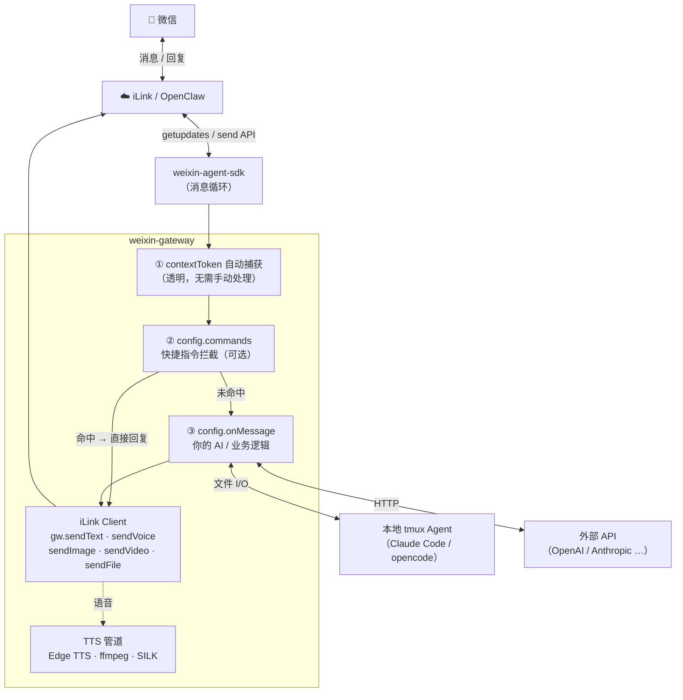

# weixin-gateway

**中文 | [English](./README.md)**

将任意 AI 后端接入微信个人号——扫码登录、contextToken 自动捕获、主动多媒体推送，内置 TTS → SILK 语音合成管道。

> **不绑定任何 AI 后端。** `onMessage` 是一个普通的异步回调函数，接入 Claude、GPT、本地 Agent 或任何其他服务，完全由你决定。

## 为什么选 weixin-gateway？

| 痛点 | 解决方式 |
|---|---|
| contextToken 难以获取 | 通过 fetch 拦截器在每次 getupdates 响应时自动捕获，透明无感 |
| 没有历史上下文无法主动推送 | 用户发出第一条消息后 token 自动持久化，此后随时推送任意媒体 |
| 微信语音需要专有 SILK 格式 | 内置管道：Edge TTS → ffmpeg PCM → silk-sdk SILK，一行代码发语音气泡 |
| 视频发送场景碎片化 | `sendVideo(wxId, urlOrPath)` 统一处理直链、本地文件、B站链接 |
| 消息路由绑死特定 AI | `onMessage` 回调完全由业务层控制；`config.commands` 在 AI 之前拦截快捷指令 |

## 架构



## 安装

```
npm install weixin-gateway
```

依赖：**Node ≥ 18**、**ffmpeg**（TTS 语音必须）。yt-dlp 可选，仅 B站链接需要。

## 快速上手

```js
const { createWeixinGateway, MemoryAdapter } = require('weixin-gateway');

const gw = createWeixinGateway({
  storage: new MemoryAdapter(),
  onMessage: async ({ wxId, text, media }) => {
    const reply = await myAI(text);
    return { text: reply };   // 返回 { text } → 自动回复
    // 返回 null              → 不自动回复，自行调用 gw.send*
  },
});

gw.subscribe(event => {
  if (event.type === 'qr')     console.log('请扫描二维码：', event.qrUrl);
  if (event.type === 'status') console.log('状态：', event.state);
});

await gw.start();   // 显示二维码，阻塞直到登录成功
```

## 媒体发送

用户发出第一条消息后，`contextToken` 自动捕获，此后可随时主动推送任意媒体——无需轮询，无需额外配置。

```js
await gw.sendText(wxId, '你好！');
await gw.sendVoice(wxId, '文字自动转为微信语音气泡');        // TTS → SILK
await gw.sendImage(wxId, 'https://example.com/img.jpg');  // HTTP URL 或本地路径
await gw.sendImage(wxId, '/tmp/screenshot.png');
await gw.sendVideo(wxId, 'https://example.com/clip.mp4'); // 直链
await gw.sendVideo(wxId, '/tmp/local.mp4');               // 本地文件
await gw.sendVideo(wxId, 'https://www.bilibili.com/video/BVxxx'); // B站自动下载
await gw.sendFile(wxId,  '/path/to/report.pdf');
```

### TTS 语音管道

`sendVoice` 将文字转为原生微信语音气泡，无需手动处理音频文件：

```
文字 → Edge TTS（MP3）→ ffmpeg（PCM s16le 16kHz）→ silk-sdk（SILK）→ 微信 CDN → voice_item
```

通过 `config.voice` 或 `lib/voice.js` 按用户或全局切换音色：

```js
const { resolveVoice } = require('weixin-gateway/lib/voice');

resolveVoice('晓晓')              // → 'zh-CN-XiaoxiaoNeural'
resolveVoice('yunxi')             // → 'zh-CN-YunxiNeural'
resolveVoice('zh-CN-YunxiNeural') // 完整 ShortName 直接透传
resolveVoice('unknown')           // → null

// 示例：切换音色指令
commands: [{
  match(text, wxId) {
    const m = text.match(/^\/voice (.+)/);
    if (!m) return null;
    const shortName = resolveVoice(m[1]);
    if (!shortName) return `未知音色：${m[1]}`;
    myVoiceMap.set(wxId, shortName);
    return `已切换至 ${m[1]}`;
  },
  usage: '/voice <音色>',
  desc: '切换 TTS 音色',
}]
```

内置别名涵盖：普通话（晓晓/晓伊/云希/云扬…）、方言（东北/陕西/台湾/粤语）、英语（ava/emma/andrew/brian/jenny…）。含 "Neural" 的完整 ShortName 直接透传。

## 指令拦截器

`config.commands` 在 `onMessage` 之前执行，适合快捷回复、开关控制、管理命令等不需要 AI 处理的场景：

```js
commands: [
  {
    match(text, wxId) {
      if (text === '/ping') return 'pong';
    },
    usage: '/ping',
    desc: '连通性测试',
  },
  {
    match(text, wxId) {
      const m = text.match(/^\/echo (.+)/);
      if (m) return m[1];
    },
    usage: '/echo <内容>',
    desc: '回显消息',
  },
],
```

- `match(text, wxId)` — 返回字符串即为回复内容；不返回则继续走 `onMessage`
- 任意指令设置了 `usage` + `desc`，即自动启用 `/help` 和 `帮助` 指令列表

## HTTP 服务（Express）

```js
const express = require('express');
const { createWeixinRouter, MemoryAdapter } = require('weixin-gateway');

const app = express();
app.use(express.json());

const { router, autoStartIfLoggedIn } = createWeixinRouter({
  storage: new MemoryAdapter(),
  onMessage: async ({ wxId, text }) => ({ text: `收到：${text}` }),
});

app.use('/weixin', router);
app.listen(3000, () => {
  autoStartIfLoggedIn().catch(console.error); // 有保存的 token 则自动重连
});
```

### 使用已有凭证（免扫码）

有效 session 可直接注入，跳过二维码：

```js
gw.restore(accountId, [{ wxId, contextToken, nickname }]);
await gw.sendText(wxId, '重新上线');
```

## 配置项

| 选项 | 类型 | 默认值 | 说明 |
|---|---|---|---|
| `storage` | `StorageAdapter` | `MemoryAdapter` | 消息与会话持久化适配器。 |
| `onMessage` | `async (params) => {text}\|null` | `null` | 消息处理回调。参数：`{ wxId, text, media, contextToken, sendMessage }`。返回 `{ text }` 自动回复，返回 `null` 则自行调用 `gw.send*`。 |
| `voice` | `string` | `zh-CN-XiaoxiaoNeural` | 默认 TTS 音色。支持所有 [Edge TTS ShortName](https://learn.microsoft.com/zh-cn/azure/ai-services/speech-service/language-support)。 |
| `commands` | `Command[]` | `[]` | `onMessage` 前置指令拦截器。 |
| `ffmpegPath` | `string` | 自动检测 | 手动指定 ffmpeg 路径。 |
| `ytdlpPath` | `string` | 自动检测 | 手动指定 yt-dlp 路径（仅 B站需要）。 |

## SDK 接口

### 生命周期

| 方法 | 说明 |
|---|---|
| `gw.start()` | 启动，显示二维码，等待扫码。 |
| `gw.stop()` | 停止并断开连接。 |
| `gw.startIfLoggedIn()` | 使用已保存的 token 自动重连。未登录时无操作。 |
| `gw.restore(accountId, sessions)` | 注入已有凭证，免扫码。`sessions`：`[{ wxId, contextToken, nickname? }]` |

### 状态查询

| 方法 | 说明 |
|---|---|
| `gw.getStatus()` | 返回 `{ state, accountId, sessions }`。state：`'idle'|'qr_pending'|'connected'` |
| `gw.getSessions()` | 返回会话数组：`[{ wxId, nickname, lastActive, contextToken }]` |

### 发送消息

所有发送方法在目标用户的 `contextToken` 未就绪时会抛出异常。

| 方法 | 说明 |
|---|---|
| `gw.sendText(wxId, text)` | 发送文字消息。 |
| `gw.sendVoice(wxId, text)` | TTS → SILK 语音气泡。 |
| `gw.sendImage(wxId, urlOrPath)` | 发送图片，支持 HTTP URL 或本地文件路径。 |
| `gw.sendVideo(wxId, urlOrPath)` | 发送视频，支持 HTTP URL、本地文件路径或 B站链接。 |
| `gw.sendFile(wxId, filePath)` | 发送本地文件。 |

### 事件订阅

```js
const off = gw.subscribe(event => {
  // event.type === 'qr'     → { qrUrl: string }   二维码更新
  // event.type === 'status' → { state: string }    状态变化
});
off(); // 取消订阅
```

### 会话管理

| 方法 | 说明 |
|---|---|
| `gw.deleteSession(wxId)` | 从内存中移除该用户会话（存储记录保留）。 |

## HTTP 路由

由 `createWeixinRouter` 提供，挂载到任意前缀（如 `app.use('/weixin', router)`）。

| 方法 | 路径 | 说明 |
|---|---|---|
| `GET` | `/status` | 守护进程状态及当前会话列表 |
| `GET` | `/qr-sse` | SSE 流 — 二维码更新推送 `{ qrUrl }`，状态变化推送 `{ type: 'weixin_status', state }` |
| `POST` | `/start` | 启动守护进程 |
| `POST` | `/stop` | 停止守护进程 |
| `POST` | `/tts` | `{ wxId?, text }` — 发送 TTS 语音 |
| `DELETE` | `/session/:wxId` | 从内存中移除该用户会话 |
| `GET` | `/media/:id` | 读取已存储的媒体 Blob |
| `GET` | `/localfile?path=` | 提供 `/tmp/` 下的本地文件（前端预览用） |
| `GET` | `/rounds` | 对话轮次 `?wxId=&limit=30&offset=0` |
| `GET` | `/messages` | 原始消息记录 `?wxId=&limit=50&offset=0` |

## 内置指令模板

`config/instruction.md` 是一份生产可用的 Claude Code 提示词模板，涵盖场景自动识别（技术/调研/翻译/写作/闲聊）、纯文本输出规范，以及 gateway 能自动解析的媒体标记：

```
[图片: https://...]     → 下载后作为图片发送
[视频: https://...]     → 下载后作为视频发送
[B站视频: https://...]  → yt-dlp 下载后发送
[截图: /tmp/ss.png]    → 直接发送本地文件
```

适用于"写入指令文件 → AI 读取并将回复写入响应文件"的文件交互后端模式：

```js
const tplPath  = require.resolve('weixin-gateway/config/instruction.md');
const template = require('fs').readFileSync(tplPath, 'utf8');

onMessage: async ({ wxId, text }) => {
  const responseFile = `/tmp/resp-${Date.now()}.txt`;
  require('fs').writeFileSync(`/tmp/input-${Date.now()}.txt`,
    template.replace('{{message}}', text).replace('{{responseFile}}', responseFile)
  );
  // ... 等待 responseFile 出现，读取内容后返回
}
```

## 存储适配器接口

实现以下接口即可接入任意持久化后端（SQLite、PostgreSQL 等）：

```js
class MyAdapter {
  saveMessage(wxId, direction, content, pairId, ts) {}
  getMessages(wxId, limit, offset)     // → { messages, total }
  getRounds(wxId, limit, offset)       // → { rounds, total }
  getUnpairedMessages()                // → [{ id, wx_id, direction }]
  updateMessagePairIds(updates)        // updates: [{ id, pairId }]
  getMaxPairIds()                      // → [{ wx_id, max_pair }]
  deleteOldMessages(cutoffTs)          // → { changes }

  saveMedia(wxId, pairId, direction, mediaType, mime, data, ts) // → id
  getMedia(id)                         // → { mime, data } | null

  upsertSession(wxId, nickname, presetType, presetCommand, presetDir, ttsVoice, lastActive, contextToken) {}
  getSessions()                        // → rows[]
}
```

默认使用内置 `MemoryAdapter`（无持久化）。

## 开发指南

### 项目结构

```
weixin-gateway/
├── index.js            # 公开 API — createWeixinGateway、createWeixinRouter
├── adapters/
│   └── memory.js       # 内置 MemoryAdapter（无持久化）
├── lib/
│   ├── ilink.js        # iLink/OpenClaw HTTP 客户端 — uploadMedia、sendItem
│   ├── media.js        # 媒体发送 — 图片、视频、文件、B站
│   ├── tts.js          # TTS 管道 — Edge TTS → ffmpeg PCM → silk-sdk SILK
│   └── voice.js        # 音色名称解析器（别名 → ShortName）
├── config/
│   └── instruction.md  # 内置 Claude Code 提示词模板
├── examples/
│   ├── server.js       # 完整 HTTP + AI 后端示例
│   ├── media-test.js   # 独立媒体发送测试（无需 HTTP server）
│   └── quickstart.js   # 最简 onMessage 示例
└── scripts/
    └── qr-login.js     # 无头扫码登录脚本
```

### 本地开发

```bash
git clone <repo>
cd weixin-gateway
npm install
```

外部依赖（需单独安装）：

| 工具 | 是否必须 | 用途 |
|---|---|---|
| `ffmpeg` | 必须 | TTS 语音管道的 PCM 转码 |
| `yt-dlp` | 可选 | B站视频下载（仅 `sendVideo` 传入 bilibili.com 链接时需要） |

### 运行测试

```bash
npm test
```

使用 Jest + supertest，无需微信账号或网络连接，所有 iLink 调用均已 mock。

### 运行示例

**完整服务（需要微信扫码）：**

```bash
node examples/server.js
# 扫描终端中的二维码，然后向机器人发一条微信消息以触发 onMessage
```

**媒体发送测试（需先用 server.js 保存一次 session）：**

```bash
node examples/media-test.js               # 全部媒体类型
node examples/media-test.js --no-voice    # 跳过 TTS（不需要 ffmpeg）
node examples/media-test.js --voice-only
```

测试脚本从 `server.js` 扫码成功后写入的 `/tmp/weixin-gateway-session.json` 读取凭证。

### 核心机制说明

**CDN token 流程（视频 / 图片 / 文件）：**

1. `ilink.uploadMedia(wxId, filePath, mediaType)` 调用 `getuploadurl` 获取预签名 `upload_param`，用 AES-128-ECB 加密文件后 POST 到 CDN。
2. CDN 在响应 header 中返回 `x-encrypted-param`（短 token，约 320–700 字符）。
3. 该 `shortParam` 作为 `downloadEncryptedQueryParam` 返回，填入发给微信的 `media` 对象——这是微信客户端用来从 CDN 下载内容的 token。
4. `uploadParam`（预签名上传 token）**不是**有效的下载 token，图片/视频/文件的 `media.encrypt_query_param` **不能**使用它。

**语音的特殊情况：** 2026-03-27 起，CDN 对 `mediaType=4` 不再返回 `x-encrypted-query-param`，TTS 管道改用 `uploadParam` 作为下载 token——这是 SILK/语音上传特有的 CDN 行为。

### 自定义存储适配器

以 `adapters/memory.js` 为模板，实现[存储适配器接口](#存储适配器接口)章节中列出的所有方法即可。

## License

MIT
